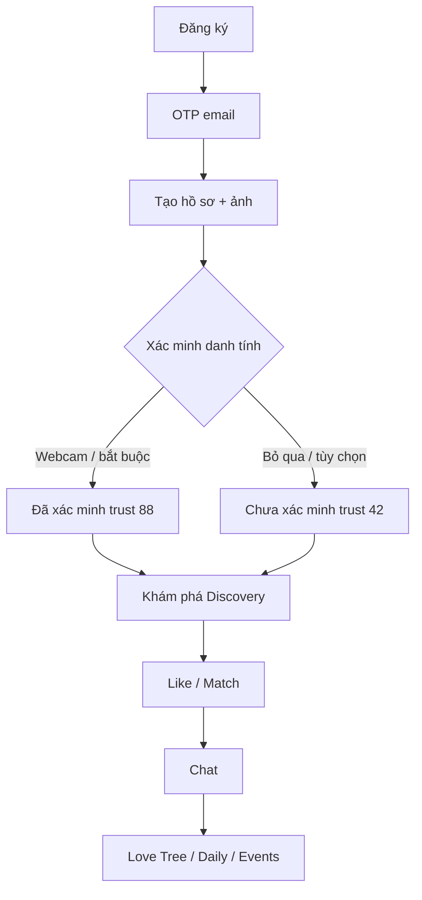

# SameMess — Business Flow & API Contract (Frontend → Backend)

Tài liệu mô tả **luồng nghiệp vụ** và **hợp đồng API** mà frontend SameMess đang dùng. Backend triển khai theo spec này để tương thích với UI hiện tại.

---

## 1. Tổng quan sản phẩm

**SameMess** là app hẹn hò / kết nối với các module:

| Module | Mục đích |
|--------|----------|
| Auth | Đăng ký, OTP, đăng nhập, quên mật khẩu |
| Onboarding | Tạo hồ sơ, upload ảnh, xác minh danh tính |
| Discovery | Lướt gợi ý, like/pass/super-like, AI matching |
| Search | Tìm người theo mood, địa điểm, sở thích, khoảng cách |
| Chat | Hội thoại sau match + gợi ý trả lời AI |
| Love Tree | Gamification mối quan hệ (7 cấp) |
| Daily Connection | Nhiệm vụ hàng ngày giữ kết nối |
| Events | Sự kiện offline, đăng ký, lịch sử, phần thưởng |
| Safety | PIN an toàn, check-in, cảnh báo khẩn cấp |
| Settings | Bảo mật, khám phá, sở thích, thiết bị |

---

## 2. Tích hợp kỹ thuật

### Base URL

```
VITE_API_BASE_URL=http://localhost:5000/api
```

Mọi path trong tài liệu là **relative** sau `/api` (vd: `/auth/login` → `http://localhost:5000/api/auth/login`).

### Authentication

- Sau login/verify OTP, frontend lưu JWT: `user.token`
- Mọi request (trừ auth public) gửi header:

```
Authorization: Bearer <access_token>
Content-Type: application/json
Accept: application/json
```

### Error response (đề xuất)

```json
{
  "message": "Mô tả lỗi hiển thị cho user",
  "code": "VALIDATION_ERROR",
  "details": {}
}
```

HTTP status: `400` validation, `401` unauthorized, `404` not found, `409` conflict, `500` server.

### Trạng thái mock

- `VITE_USE_MOCK_API=true`: frontend chỉ dùng mock local
- `VITE_USE_MOCK_API=false`: gọi backend; dev mode có thể fallback mock khi lỗi mạng

---

## 3. Luồng người dùng chính (User Journey)



### Điều hướng sau đăng nhập (`getPostAuthRoute`)

| Điều kiện | Route |
|-----------|-------|
| Chưa onboard (`onboarded = false`) | `/create-profile` |
| Bật "xác minh bắt buộc" + chưa xác minh | `/account-verification` |
| Còn lại | `/discovery` |

---

## 4. Auth — Xác thực

### 4.1 Đăng ký

**UI flow:** `/register` → nhập tên, email, mật khẩu → `/verify-otp`

**API:** `POST /auth/register`

**Request:**
```json
{
  "name": "Nguyễn Minh Anh",
  "email": "user@gmail.com",
  "password": "Abc123!@#"
}
```

**Response:**
```json
{
  "success": true,
  "requiresOtp": true
}
```

**Validation frontend (backend nên mirror):**
- `name`: 2–50 ký tự, chỉ chữ + khoảng trắng, **không số**
- `email`: format hợp lệ, max 254
- `password`: 8–64 ký tự, có hoa/thường/số/ký tự đặc biệt, không space

---

### 4.2 Xác thực OTP

**UI flow:** `/verify-otp` — purpose: `register` | `reset`

**API:** `POST /auth/verify-otp`

**Request:**
```json
{
  "email": "user@gmail.com",
  "otp": "123456",
  "purpose": "register"
}
```

**Response (register):**
```json
{
  "success": true,
  "user": {
    "id": "uuid",
    "email": "user@gmail.com",
    "name": "Nguyễn Minh Anh"
  },
  "token": "jwt-access-token",
  "refreshToken": "optional"
}
```

**Sau OTP register**, frontend kỳ vọng:
- `onboarded: false`
- `identityVerified: false`
- `trustScore: 42`
→ chuyển `/create-profile`

**Resend OTP:** frontend chưa có endpoint riêng — backend nên thêm `POST /auth/resend-otp` `{ email, purpose }`.

---

### 4.3 Đăng nhập

**API:** `POST /auth/login`

**Request:**
```json
{
  "email": "user@gmail.com",
  "password": "Abc123!@#"
}
```

**Response:**
```json
{
  "user": {
    "id": "uuid",
    "email": "user@gmail.com",
    "name": "Nguyễn Minh Anh",
    "onboarded": true,
    "identityVerified": true,
    "trustScore": 88
  },
  "token": "jwt-access-token"
}
```

---

### 4.4 Quên / đặt lại mật khẩu

| Bước | API | Body |
|------|-----|------|
| Gửi OTP | `POST /auth/forgot-password` | `{ "email" }` |
| Xác OTP | `POST /auth/verify-otp` | `{ email, otp, purpose: "reset" }` |
| Đổi MK | `POST /auth/reset-password` | `{ email, otp, password, confirmPassword }` |

---

## 5. Hồ sơ (Profile)

### 5.1 Lấy hồ sơ hiện tại

**UI:** `/profile`, TopNav avatar

**API:** `GET /profile/me`

**Response:**
```json
{
  "id": "uuid",
  "displayName": "Nguyễn Minh Anh",
  "username": "minhanh_23",
  "email": "user@gmail.com",
  "avatarUrl": "https://cdn.../avatar.jpg",
  "profilePhotos": [
    {
      "id": "photo-1",
      "url": "https://cdn.../1.jpg",
      "source": "library|device|upload",
      "order": 0
    }
  ],
  "photoCount": 3,
  "age": 25,
  "city": "Hà Nội, Việt Nam",
  "district": "Cầu Giấy",
  "occupation": "Thiết kế UX",
  "bio": "Thích cà phê và du lịch",
  "personality": "Cân bằng",
  "sexualOrientation": "heterosexual",
  "shareSexualOrientation": false,
  "identityVerified": true,
  "verificationMethod": "camera_pc",
  "verifiedAt": "2025-05-22T10:00:00Z",
  "trustScore": 88,
  "verificationRequired": false,
  "stats": {
    "likes": 12,
    "connections": 5,
    "completion": 89
  }
}
```

**Trường bắt buộc khi tạo hồ sơ (`/create-profile`):**
- `displayName`, `username`, `age`, `city`
- Ảnh: frontend yêu cầu **ít nhất 1 ảnh** (slot đầu = avatar)

**Trường tùy chọn:**
- `occupation`, `bio`, `personality`, `sexualOrientation` (chỉ khi user bật chia sẻ)

**Username rules:** `^[a-z0-9_]{3,20}$`, không space, không hoa.

**Personality options:** `Hướng ngoại | Hướng nội | Cân bằng | Lãng mạn | Thực tế`

**Sexual orientation values:** `heterosexual`, `homosexual`, `bisexual`, `pansexual`, `asexual`, `queer`, `other`, `prefer_not_say`

---

### 5.2 Cập nhật hồ sơ

**API:** `PUT /profile`

**Request:** partial update — các field như trên.

**Response:**
```json
{ "success": true }
```

---

### 5.3 Upload ảnh hồ sơ (backend cần bổ sung)

Frontend hiện lưu ảnh local (`dataUrl` / URL thư viện). **Backend nên cung cấp:**

`POST /profile/photos` — `multipart/form-data`

```json
// Response
{
  "photos": [
    { "id": "...", "url": "https://cdn.../x.jpg", "order": 0 }
  ],
  "avatarUrl": "https://cdn.../x.jpg"
}
```

Nguồn ảnh UI hỗ trợ: `device` (file), `library` (preset URL), `google` (URL từ search).

---

## 6. Xác minh danh tính & Uy tín (Trust)

### Business rules

| Trạng thái | `trustScore` | Badge |
|------------|--------------|-------|
| Đã xác minh (webcam PC) | **88** | Đã xác minh danh tính |
| Chưa xác minh | **42** | Chưa xác minh |

- Xác minh qua **webcam** trên `/account-verification` — chụp frame JPEG base64
- CMND/CCCD: UI có nút nhưng **disabled** ("sắp có") — backend có thể thêm `type: "id_card"` sau
- Setting **"Xác minh bắt buộc"** (`verificationRequired`): hiện lưu client — backend nên lưu per-user hoặc per-app-config

### API xác minh

**UI:** `/account-verification`

**API:** `POST /profile/verification`

**Request:**
```json
{
  "type": "face",
  "photo": "data:image/jpeg;base64,..."
}
```

**Response:**
```json
{
  "success": true,
  "verified": true,
  "type": "face",
  "trustScore": 88,
  "verifiedAt": "2025-05-22T10:00:00Z"
}
```

**Skip:** chỉ khi `verificationRequired = false` → user vào Discovery với trust 42.

**Ảnh hưởng matching:**
- Candidate `identityVerified: true` → +4% boost trong thuật toán frontend
- Discovery filter `verifiedOnly` (settings) → chỉ hiện user đã xác minh

---

## 7. Khám phá (Discovery)

### 7.1 Feed gợi ý

**UI:** `/discovery` — card swipe, picks top 3

**API:** `GET /discovery/feed`

**Query (đề xuất):** `ageMin`, `ageMax`, `distanceKm`, `verifiedOnly`, `showMe`

**Response:**
```json
{
  "profiles": [
    {
      "id": "minh",
      "name": "Minh",
      "age": 27,
      "job": "Thiết kế UX",
      "location": "Quận 1, TP. Hồ Chí Minh",
      "city": "TP. Hồ Chí Minh",
      "district": "Quận 1",
      "region": "Nam",
      "tags": ["THIẾT KẾ", "CÀ PHÊ"],
      "interests": ["Thiết kế", "Cà phê", "Du lịch"],
      "personality": "Hướng ngoại",
      "image": "https://cdn.../photo.jpg",
      "match": 92,
      "reasons": ["Cùng sở thích: Cà phê", "Cùng TP. Hồ Chí Minh"],
      "matchBreakdown": {
        "interests": 85,
        "location": 100,
        "age": 90,
        "personality": 95
      },
      "identityVerified": true,
      "trustScore": 88,
      "verificationMethod": "camera_pc"
    }
  ],
  "picks": [
    { "id": "minh", "name": "Minh", "image": "...", "match": 92 }
  ]
}
```

**Thuật toán match (frontend reference — backend có thể implement server-side):**

| Tiêu chí | Trọng số |
|----------|----------|
| Sở thích chung | 35% |
| Vị trí (quận > TP > miền) | 25% |
| Độ tuổi trong range | 20% |
| Tính cách tương thích | 12% |
| Nghề nghiệp tương đồng | 8% |
| Bonus xác minh | +4% |

`match` = 52–99 (integer %).

---

### 7.2 AI Matching (quét hàng loạt)

**UI:** nút "Bắt đầu matching" → animation 4 bước → sắp xếp lại feed

**API:** `POST /discovery/match`

**Response:**
```json
{
  "userCriteria": {
    "interests": ["Cà phê", "Du lịch"],
    "personality": "Cân bằng",
    "location": "Hà Nội",
    "ageRange": "21–31"
  },
  "bestMatch": { /* profile object */ },
  "suggestions": [ /* 2-3 profiles */ ],
  "totalScanned": 150
}
```

---

### 7.3 Hành động trên card

| Hành động UI | API | Response kỳ vọng |
|--------------|-----|------------------|
| Bỏ qua (X) | `POST /discovery/:id/pass` | `{ success: true }` |
| Kết nối / Like (♥) | `POST /discovery/:id/like` | xem bên dưới |
| Super Like (⭐) | `POST /discovery/:id/super-like` | `{ success: true }` |
| Icebreaker | `POST /discovery/:id/icebreaker` | `{ success: true }` |

**Like / Connect response (mutual match):**
```json
{
  "success": true,
  "matched": true,
  "conversationId": "minh"
}
```

- `conversationId` = `partnerId` — frontend navigate `/chat/:conversationId`
- Nếu chưa mutual: `{ matched: false }`

---

## 8. Tìm kiếm (Search)

### 8.1 Bộ lọc metadata

**API:** `GET /search/filters`

**Response:**
```json
{
  "moods": [
    { "id": "vui", "label": "Vui vẻ", "icon": "😊", "desc": "..." }
  ],
  "wantToGo": [
    { "id": "cafe", "label": "Quán cà phê", "icon": "☕" }
  ],
  "cities": [
    { "id": "hcm", "label": "TP. Hồ Chí Minh", "region": "Nam" }
  ],
  "proximity": [
    { "id": "district", "label": "Cùng quận", "desc": "~5 km", "maxKm": 5 },
    { "id": "city", "label": "Cùng thành phố", "maxKm": 35 },
    { "id": "region", "label": "Cùng miền", "maxKm": null }
  ],
  "userCity": "TP. Hồ Chí Minh"
}
```

**Mood IDs:** `vui`, `binh_yen`, `lang_man`, `kham_pha`, `tam_su`

**Want-to-go IDs:** `cafe`, `cong_vien`, `an_uong`, `trien_lam`, `bien_song`, `am_nhac`

---

### 8.2 Tìm kiếm

**API:** `GET /search`

**Query params:**
```
mood=vui
wantToGo=cafe
cityId=hcm
proximity=city
gender=all|male|female
ageMax=30
interests=Cà phê,Nhiếp ảnh
```

**Response:**
```json
{
  "results": [
    {
      "id": "thao",
      "name": "Thảo",
      "age": 25,
      "gender": "female",
      "city": "TP. Hồ Chí Minh",
      "district": "Quận 1",
      "region": "Nam",
      "distanceKm": 1.2,
      "moodToday": "vui",
      "wantToGo": ["cafe", "cong_vien"],
      "wantToGoLabels": ["Quán cà phê", "Phố đi bộ"],
      "match": 94,
      "tags": ["Cà phê", "Nhiếp ảnh"],
      "image": "https://cdn.../photo.jpg"
    }
  ],
  "meta": {
    "city": "TP. Hồ Chí Minh",
    "region": "Nam",
    "proximity": "Cùng thành phố",
    "total": 5
  }
}
```

**Sort:** `match - distanceKm * 0.5` (desc).

**Sở thích:** frontend merge preset + custom (user thêm tag "Khác") — backend nên `GET/PUT /settings/interests`.

---

## 9. Chat

### 9.1 Danh sách hội thoại

**API:** `GET /chat/conversations`

**Response:**
```json
{
  "conversations": [
    {
      "id": "linh",
      "partnerId": "linh",
      "partnerName": "Linh",
      "partnerAvatar": "💕",
      "partnerImage": "https://cdn.../linh.jpg",
      "matchPercent": 88,
      "status": "Đang online",
      "lastMessage": "Cuối tuần này bạn rảnh đi cafe không? ☕",
      "lastMessageAt": "2024-08-21T09:12:00Z",
      "unreadCount": 2
    }
  ]
}
```

---

### 9.2 Tin nhắn

**API:** `GET /chat/conversations/:id/messages`

**Response:**
```json
{
  "messages": [
    {
      "id": "l1",
      "role": "partner|user|system",
      "content": "Chào bạn!...",
      "createdAt": "2024-08-21T08:50:00Z"
    }
  ],
  "dailyQuest": {
    "day": 4,
    "title": "Chia sẻ một sở thích bí mật..."
  }
}
```

**Gửi tin:** `POST /chat/conversations/:id/messages`

```json
{ "content": "Nội dung tin nhắn" }
```

**Response:**
```json
{
  "message": {
    "id": "m-123",
    "role": "user",
    "content": "...",
    "createdAt": "2025-05-22T10:00:00Z"
  }
}
```

**Sau match mới:** frontend tạo conversation nếu chưa có (hiện mock `ensureConversation`) — backend nên auto-create khi `matched: true`.

**Đánh dấu đã đọc:** `POST /chat/conversations/:id/read` (đề xuất).

---

### 9.3 Gợi ý AI trả lời

**UI:** panel AI bên phải chat, tự refresh khi có tin mới

**API:** `POST /chat/conversations/:id/ai-suggestions`

**Request:**
```json
{
  "messages": [
    { "id": "m2", "role": "partner", "content": "...", "createdAt": "..." }
  ]
}
```

**Response:**
```json
{
  "suggestions": [
    { "id": "s1", "text": "Mình biết quán view đẹp...", "tone": "date" }
  ],
  "insight": "Đối phương đang mở chủ đề leo núi...",
  "generatedAt": "2025-05-22T10:00:00Z"
}
```

**Tone values:** `curious`, `date`, `warm`, `friendly`

---

## 10. Love Tree (Cây tình yêu)

**UI:** `/love-tree`, `/love-tree/level-up`

Gamification cho cặp đang chat — **7 cấp** (mỗi cấp 1 giai đoạn cây khác nhau).

| API | Mô tả |
|-----|-------|
| `GET /love-tree` | State hiện tại |
| `POST /love-tree/care` | Hành động chăm cây `{ actionId: "water\|sun\|love" }` |
| `GET /love-tree/level-up` | Màn hình lên cấp |

**GET /love-tree response:**
```json
{
  "level": 1,
  "maxLevel": 7,
  "levelLabel": "Mầm non",
  "attachmentPercent": 0,
  "xpToNext": 100,
  "careActions": [
    { "id": "water", "icon": "💧", "label": "Tưới nước", "points": 3 }
  ],
  "milestones": [
    { "id": 1, "title": "Mầm non đầu tiên", "date": "12/10/2023", "unlocked": true }
  ],
  "partnerId": "linh"
}
```

Backend gắn love tree theo `conversationId` hoặc `coupleId`.

---

## 11. Daily Connection

**UI:** `/daily-connection` + quest trong chat

| API | Mô tả |
|-----|-------|
| `GET /daily/connection` | Streak + danh sách quest |
| `POST /daily/complete` | Hoàn thành `{ questIds: ["lunch", "dream"] }` |

**GET response:**
```json
{
  "streakDay": 4,
  "streakTotal": 7,
  "rewardProgress": 57,
  "quests": [
    {
      "id": "lunch",
      "icon": "🍽️",
      "title": "Chia sẻ bữa trưa",
      "desc": "...",
      "type": "solo|joint"
    }
  ]
}
```

---

## 12. Gợi ý hẹn hò (Date Suggestions)

**UI:** `/date-suggestions`

**API:** `GET /dates/suggestions`

**Response:**
```json
{
  "categories": [
    { "id": "coffee", "label": "Cà phê", "icon": "☕" }
  ],
  "featured": {
    "title": "Workshop gốm thủ công tại Quận 3",
    "match": 92,
    "image": "https://..."
  },
  "forBoth": [
    {
      "id": "ba-vi",
      "title": "Leo núi Ba Vì & ngắm hoàng hôn",
      "match": 88,
      "image": "https://..."
    }
  ]
}
```

Gợi ý dựa trên couple interests + location — backend generate.

---

## 13. Sự kiện & Premium

### 13.1 Events

| API | Mô tả |
|-----|-------|
| `GET /events` | Danh sách + categories |
| `GET /events/:id` | Chi tiết |
| `POST /events/:id/register` | Đăng ký |
| `GET /events/history` | Lịch sử tham gia |
| `GET /events/reward?eventId=` | Mã thưởng sau sự kiện |

**Event object:**
```json
{
  "id": "sunset-vineyard",
  "title": "Thưởng thức rượu vang hoàng hôn",
  "category": "dining",
  "premiumOnly": true,
  "almostSoldOut": true,
  "date": "Thứ Bảy, 24/08",
  "time": "16:00 – 20:00",
  "location": "Thung lũng rượu vang Đà Lạt",
  "address": "...",
  "attendees": 42,
  "image": "https://...",
  "thumb": "https://...",
  "about": "...",
  "schedule": [
    { "time": "16:00", "label": "Đón khách", "icon": "🥂" }
  ],
  "spotsLeft": 8,
  "soldOut": false
}
```

**Register response:**
```json
{
  "success": true,
  "eventId": "sunset-vineyard",
  "rewardEligible": true
}
```

**Reward response:**
```json
{
  "code": "SAMEMESS50",
  "title": "Giảm 50% cho buổi hẹn đầu tiên",
  "venue": "The Blue Note Coffee & Lounge",
  "expiresAt": "2025-12-31",
  "trustScoreDelta": 10
}
```

---

### 13.2 Premium

| API | Mô tả |
|-----|-------|
| `GET /premium/plans` | Gói + features |
| `POST /premium/subscribe` | `{ planId: "monthly\|6months\|yearly" }` |

---

## 14. An toàn (Safety)

### Flow

```
/safety → cài đặt liên hệ khẩn cấp
/safety-pin-setup → đặt PIN 4-6 số
/safety-checkin → check-in khi hẹn hò (cần PIN)
/safety-pin-forgot → gửi OTP reset PIN
/safety-pin-otp → xác OTP
/emergency-alert → màn hình người thân nhận cảnh báo
```

| API | Body / Response |
|-----|-----------------|
| `GET /safety/settings` | contactName, contactPhone, safeZone, safeTime, radiusMeters |
| `PUT /safety/settings` | partial update |
| `POST /safety/pin` | `{ pin }` |
| `POST /safety/pin/forgot` | `{ channel: "email\|sms" }` |
| `POST /safety/pin/verify-otp` | `{ otp }` |
| `POST /safety/checkin` | `{ location?, pin, status: "ok\|help" }` |
| `GET /safety/emergency` | alert cho người nhận (polling hoặc push) |

**Emergency response:**
```json
{
  "contactName": "Trần Minh Tuấn",
  "location": "Phố đi bộ Nguyễn Huệ, Quận 1",
  "updatedMinutesAgo": 2,
  "userId": "...",
  "alertActive": true
}
```

---

## 15. Cài đặt (Settings)

| API | Mô tả |
|-----|-------|
| `GET /settings/security` | `{ twoFactor, loginAlerts, verificationRequired, ... }` |
| `PUT /settings/security` | Cập nhật toggles |
| `GET /settings/devices` | Danh sách thiết bị đăng nhập |
| `PUT /settings/password` | `{ currentPassword, newPassword, confirmPassword }` |
| `GET /settings/discovery` | distanceKm, ageMin, ageMax, showMe, verifiedOnly, globalMode |
| `PUT /settings/discovery` | partial |
| `GET /settings/interests` | `{ selected: [], groups: [] }` |
| `PUT /settings/interests` | `{ selected: ["Cà phê", "Yoga"] }` |

**Discovery settings fields:**
- `distance`: 1–200 km
- `ageMin` / `ageMax`: 18–60
- `showMe`: `everyone | male | female`
- `verifiedOnly`: boolean
- `globalMode`: boolean

**Security toggles UI (cần persist):**
- 2FA, thông báo tin nhắn/match/sự kiện, incognito, ẩn hồ sơ, xác minh bắt buộc, dark theme (theme = client-only)

---

## 16. Entity quan hệ (gợi ý DB)

```
User
 ├── Profile (photos, bio, personality, trust, verification)
 ├── DiscoveryPreferences
 ├── Interests[]
 ├── Conversations[] → Messages[]
 ├── Matches[] (userId ↔ partnerId, matchedAt)
 ├── LoveTree (per couple)
 ├── DailyQuestProgress
 ├── EventRegistrations[]
 ├── SafetySettings + SafetyPin (hashed)
 └── Subscriptions (premium)
```

---

## 17. Checklist tương thích Frontend

| Ưu tiên | API | Ghi chú |
|---------|-----|---------|
| P0 | Auth full flow | JWT + onboarded flag |
| P0 | GET/PUT profile + photo upload | Thay localStorage |
| P0 | Discovery feed + like/pass + match | Trả `conversationId` |
| P0 | Chat conversations + messages | WebSocket optional |
| P1 | POST profile/verification | Nhận base64 face |
| P1 | Search + filters | Mood/proximity logic |
| P1 | Settings discovery + interests | Sync filter Discovery |
| P2 | AI suggestions | LLM service |
| P2 | Love tree + daily quests | Gamification |
| P2 | Events + premium | Thanh toán |
| P2 | Safety + emergency | Real-time alert |

---

## 18. File tham chiếu trong repo Frontend

| File | Nội dung |
|------|----------|
| `src/api/config.js` | Tất cả endpoint paths |
| `src/api/services/*.service.js` | Contract từng domain |
| `src/api/mocks/*.mock.js` | Sample response |
| `src/utils/validation.js` | Rule validate form |
| `src/utils/matching.js` | Thuật toán match % |
| `src/utils/identityVerification.js` | Trust score logic |
| `src/data/profileFields.js` | Field definitions |

---

*Tài liệu sync với frontend SameMess — cập nhật khi có thay đổi API.*
