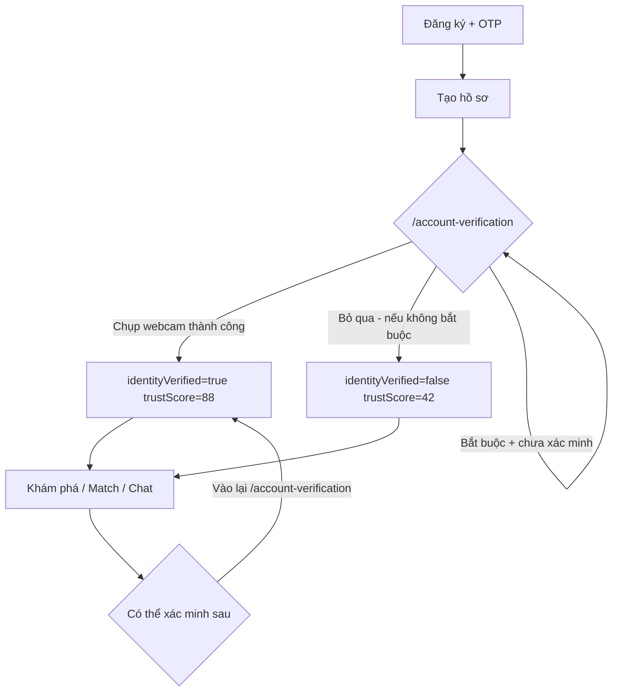

# SameMess — Flow Business: Uy tín & Xác minh danh tính

Tài liệu mô tả **luồng nghiệp vụ uy tín** (trust score) gắn với **xác minh khuôn mặt / danh tính**, để backend triển khai đồng bộ với frontend.

---

## 1. Khái niệm

| Thuật ngữ | Ý nghĩa |
|-----------|---------|
| **Uy tín** (`trustScore`) | Điểm tin cậy hồ sơ, hiển thị cho user và người khác thấy |
| **Xác minh danh tính** (`identityVerified`) | User đã qua bước nhận diện khuôn mặt (webcam) |
| **Badge** | Nhãn UI: `Đã xác minh` ✓ hoặc `Chưa xác minh` ○ |

**Uy tín trong app hiện tại chủ yếu phụ thuộc xác minh danh tính** (chưa quét mặt = thấp, đã quét = cao).

---

## 2. Bảng điểm uy tín (frontend constants)

| Trạng thái | `identityVerified` | `trustScore` | Badge |
|------------|-------------------|--------------|-------|
| **Chưa xác minh** (không quét khuôn mặt / bỏ qua) | `false` | **42** | ○ Chưa xác minh |
| **Đã xác minh** (webcam PC thành công) | `true` | **88** | ✓ Đã xác minh |

- Chênh lệch: **+46 điểm** (`TRUST_SCORE_DELTA`)
- Scale: **0–100** (hiển thị, không phải XP tích lũy từng bước nhỏ)
- *Lưu ý:* Nếu product muốn **43** thay vì 42, backend chỉ cần đổi constant `TRUST_SCORE_UNVERIFIED` — logic flow giữ nguyên.

---

## 3. Luồng người dùng (User Journey)



### 3.1 Sau đăng ký OTP (`/verify-otp`)

User mới được gán mặc định:

```json
{
  "identityVerified": false,
  "trustScore": 42,
  "verificationMethod": null,
  "verifiedAt": null
}
```

### 3.2 Sau tạo hồ sơ (`/create-profile`)

→ Chuyển **`/account-verification`** (bước xác minh danh tính).

### 3.3 Trang xác minh (`/account-verification`)

**Hai chế độ** (cấu hình app / user):

| Chế độ | Setting | Hành vi |
|--------|---------|---------|
| **Tùy chọn** | `verificationRequired = false` (mặc định) | Có nút **Bỏ qua** → vào Discovery với uy tín **42** |
| **Bắt buộc** | `verificationRequired = true` | Không bỏ qua được → phải xác minh webcam |

**Cách xác minh đang hoạt động:**

1. Mở webcam trình duyệt (`getUserMedia`)
2. User căn mặt vào khung oval
3. Chụp frame → JPEG base64
4. Gửi API `POST /profile/verification`
5. Thành công → cập nhật user:

```json
{
  "identityVerified": true,
  "trustScore": 88,
  "verificationMethod": "camera_pc",
  "verifiedAt": "2025-05-29T10:00:00Z",
  "verificationPhoto": "data:image/jpeg;base64,..."
}
```

**Phương thức khác (sắp có):**

- `id_card` — quét CMND/CCCD: UI có nút nhưng **disabled** (“sắp có”)

### 3.4 Đăng nhập lại (`getPostAuthRoute`)

| Điều kiện | Điều hướng |
|-----------|------------|
| Chưa onboard | `/create-profile` |
| `verificationRequired` + chưa xác minh | `/account-verification` |
| Còn lại | `/discovery` |

---

## 4. Cấu hình liên quan uy tín

### 4.1 Xác minh bắt buộc

- **UI:** Cài đặt → Bảo mật → toggle **“Xác minh danh tính bắt buộc”**
- **Frontend key:** `localStorage` → `samemess_app_settings.verificationRequired`
- **Backend nên:** `GET/PUT /settings/security` → `{ verificationRequired: boolean }`

### 4.2 Chỉ xem người đã xác minh

- **UI:** Cài đặt → Khám phá → **“Chỉ hiện hồ sơ đã xác minh”**
- **Frontend:** `user.discoveryPrefs.verifiedOnly` (mặc định `true`)
- **Backend:** `GET/PUT /settings/discovery` → `{ verifiedOnly: boolean }`
- **Feed:** `GET /discovery/feed?verifiedOnly=true` → chỉ trả candidate `identityVerified === true`

---

## 5. Uy tín hiển thị ở đâu?

| Màn hình | Nội dung |
|----------|----------|
| **Hồ sơ** (`/profile`) | Số uy tín + badge Đã/Chưa xác minh |
| **Khám phá** (`/discovery`) | Badge + trust trên card ứng viên |
| **Xác minh** (`/account-verification`) | So sánh 42 vs 88 trước khi chụp |
| **Cài đặt bảo mật** | Giải thích chênh +46 khi bật bắt buộc |

**Component:** `VerificationBadge` — props: `verified`, `trustScore`, `showTrust`, `showLabel`

---

## 6. Uy tín ảnh hưởng nghiệp vụ gì?

### 6.1 Thuật toán ghép đôi (Discovery)

Trên mỗi **ứng viên** (candidate):

```json
{
  "identityVerified": true,
  "trustScore": 88,
  "verificationMethod": "camera_pc"
}
```

**Frontend matching** (`scoreMatchCandidate`):

- Ứng viên **đã xác minh** → **+4%** vào điểm match tổng
- Lý do hiển thị: *"Đã xác minh danh tính · uy tín cao"*

Backend có thể implement tương tự server-side.

### 6.2 Lọc feed

- `verifiedOnly = true` → ẩn toàn bộ user `identityVerified: false`

### 6.3 Phần thưởng sự kiện (dự kiến)

- Sau tham gia event: `GET /events/reward` trả `trustScoreDelta: 10`
- **UI** hiển thị “Cộng +10 điểm tin cậy” — backend có thể cộng vào `trustScore` (cap 100) hoặc tách `eventTrustBonus`

---

## 7. API contract (backend)

### 7.1 Lấy hồ sơ (có uy tín)

`GET /profile/me`

```json
{
  "identityVerified": false,
  "verificationMethod": null,
  "verifiedAt": null,
  "trustScore": 42,
  "verificationStatus": {
    "label": "Chưa xác minh danh tính",
    "shortLabel": "Chưa xác minh"
  },
  "verificationRequired": false
}
```

### 7.2 Gửi xác minh khuôn mặt

`POST /profile/verification`

**Request:**

```json
{
  "type": "face",
  "photo": "data:image/jpeg;base64,..."
}
```

**Response thành công:**

```json
{
  "success": true,
  "verified": true,
  "type": "face",
  "trustScore": 88,
  "verifiedAt": "2025-05-29T10:00:00Z"
}
```

**Response lỗi:**

```json
{
  "message": "Không nhận diện được khuôn mặt",
  "code": "FACE_MISMATCH"
}
```

**Backend xử lý gợi ý:**

1. Lưu ảnh xác minh (storage riêng, không public profile)
2. So khớp face (optional: với ảnh hồ sơ)
3. Cập nhật `users.identity_verified`, `trust_score`, `verified_at`, `verification_method`
4. Không cho revert về 42 trừ khi admin / re-verify policy

### 7.3 Discovery feed / candidate

Mỗi profile trả về:

```json
{
  "id": "linh",
  "name": "Linh",
  "identityVerified": true,
  "trustScore": 88,
  "verificationMethod": "camera_pc"
}
```

### 7.4 Cập nhật cài đặt

`PUT /settings/security`

```json
{
  "verificationRequired": true
}
```

`PUT /settings/discovery`

```json
{
  "verifiedOnly": true
}
```

---

## 8. Model dữ liệu gợi ý (DB)

```sql
users
  identity_verified      BOOLEAN DEFAULT FALSE
  trust_score            SMALLINT DEFAULT 42    -- 42 | 88 (+ bonus event sau)
  verification_method    VARCHAR NULL           -- 'camera_pc' | 'id_card' | NULL
  verified_at            TIMESTAMPTZ NULL
  verification_photo_url TEXT NULL              -- private bucket

user_settings
  verification_required  BOOLEAN DEFAULT FALSE   -- per-user override (optional)
  discovery_verified_only BOOLEAN DEFAULT TRUE

-- Hoặc app_config global cho verification_required
```

**Quy tắc nghiệp vụ:**

```
ON identity_verified = TRUE  → trust_score = 88 (base)
ON identity_verified = FALSE → trust_score = 42 (base)
ON event_reward / admin      → trust_score = MIN(100, trust_score + delta)
```

---

## 9. Mock data ứng viên (frontend)

| ID | Xác minh | Uy tín |
|----|----------|--------|
| minh, linh, đức | ✓ | 88 |
| hoàng, thảo, my | ○ | 42 |

File: `src/api/mocks/discovery.mock.js`

---

## 10. File tham chiếu frontend

| File | Vai trò |
|------|---------|
| `src/utils/identityVerification.js` | Constants 42/88, logic trust, routing |
| `src/pages/User/AccountVerification/AccountVerification.jsx` | Flow webcam |
| `src/api/services/profile.service.js` | `submitVerification` |
| `src/components/User/VerificationBadge/VerificationBadge.jsx` | Badge UI |
| `src/utils/matching.js` | +4% match nếu verified |
| `src/api/services/discovery.service.js` | Lọc `verifiedOnly` |
| `src/pages/User/Settings/SecuritySettings/SecuritySettings.jsx` | Toggle bắt buộc |
| `src/pages/User/Settings/DiscoverySettings/DiscoverySettings.jsx` | Toggle chỉ verified |

---

## 11. Checklist backend

- [ ] Lưu `identityVerified` + `trustScore` trên user, sync mọi API profile
- [ ] `POST /profile/verification` — nhận base64, xử lý face, trả 88
- [ ] User mới mặc định: `verified=false`, `trust=42`
- [ ] `verificationRequired` + `verifiedOnly` persist qua settings API
- [ ] Discovery feed trả `identityVerified`, `trustScore` mỗi candidate
- [ ] (Tùy chọn) Cộng `trustScoreDelta` từ event reward
- [ ] (Tương lai) `type: id_card` cho CMND/CCCD

---

*Tài liệu sync với frontend SameMess — hằng số uy tín: **42** (chưa xác minh) / **88** (đã xác minh webcam).*
